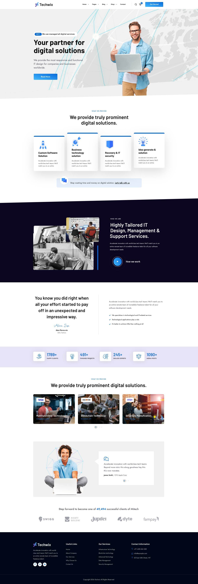
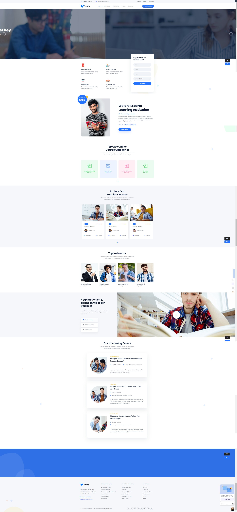

# PITSI403-Layout

ZADANIE:
Nowa strona BCU

Informacje: https://www.zdz.katowice.pl/zapraszamy-na-szkolenia-w-bcu

Stara strona: https://bcuskyport.katowice.pl/

PROPOZYCJE:

---

### Paweł: 
[Link do sklepu](https://preview.themeforest.net/item/techwix-technology-it-solutions-wordpress-theme/full_screen_preview/53797889)

---

### Mateusz:
[Link do sklepu](https://elements.envato.com/edura-online-courses-education-wordpress-theme-A5T4N4W)

---

### oskar:
[Link do sklepu](https://www.free-css.com/free-css-templates/page295/esigned)

---

### Marek:
[Link do sklepu](https://www.templatemonster.com/pl/szablony-wordpress-99612.html)

